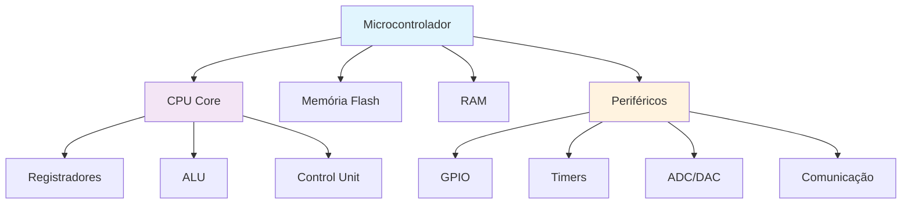

# 🏗️ Módulo 1: Fundamentos de Sistemas Embarcados

## 🎯 **Objetivos de Aprendizagem Acadêmica**

Ao final deste módulo, você será capaz de:
- ✅ Compreender arquiteturas de microcontroladores e processadores embarcados
- ✅ Analisar limitações de recursos em sistemas embarcados
- ✅ Comparar Rust vs C/C++ em contextos embarcados
- ✅ Entender conceitos de sistemas em tempo real
- ✅ Avaliar trade-offs entre performance, segurança e manutenibilidade
- ✅ Desenvolver metodologia de pesquisa para análise comparativa

## 📚 **Conteúdo Teórico Acadêmico**

### **1.1 Arquitetura de Sistemas Embarcados**

#### **Componentes Fundamentais**


#### **Tipos de Arquiteturas**
- **ARM Cortex-M**: Baixo consumo, alta eficiência
- **AVR**: Simples, amplamente usado (Arduino)
- **RISC-V**: Open source, crescente adoção
- **x86**: Potência, complexidade

### **1.2 Limitações de Recursos**

#### **Memória**
```rust
// Exemplo de limitações de memória
#![no_std]
#![no_main]

use core::mem;

// Arduino Uno: 32KB Flash, 2KB RAM
const MAX_FLASH_SIZE: usize = 32 * 1024;  // 32KB
const MAX_RAM_SIZE: usize = 2 * 1024;     // 2KB

struct SystemResources {
    flash_used: usize,
    ram_used: usize,
}

impl SystemResources {
    fn new() -> Self {
        Self {
            flash_used: 0,
            ram_used: 0,
        }
    }
    
    fn check_memory_usage<T>(&mut self, data: &T) -> bool {
        let size = mem::size_of_val(data);
        
        if self.ram_used + size > MAX_RAM_SIZE {
            return false; // Sem memória suficiente
        }
        
        self.ram_used += size;
        true
    }
}
```

#### **Consumo Energético**
```rust
// Estratégias de economia de energia
enum PowerMode {
    Active,      // 100% consumo
    Sleep,       // 10% consumo
    DeepSleep,   // 1% consumo
    Hibernate,   // 0.1% consumo
}

struct PowerManager {
    current_mode: PowerMode,
    battery_level: u8,
}

impl PowerManager {
    fn optimize_power(&mut self) {
        match self.battery_level {
            0..=20 => self.enter_hibernate(),
            21..=50 => self.enter_deep_sleep(),
            51..=80 => self.enter_sleep(),
            _ => self.enter_active(),
        }
    }
    
    fn enter_sleep(&mut self) {
        // Implementar modo sleep
        self.current_mode = PowerMode::Sleep;
    }
}
```

### **1.3 Sistemas em Tempo Real**

#### **Características**
- **Determinismo**: Comportamento previsível
- **Latência**: Tempo de resposta limitado
- **Throughput**: Taxa de processamento garantida
- **Prioridade**: Hierarquia de tarefas

#### **Classificação**
```rust
// Sistema de prioridades em tempo real
#[derive(Debug, PartialEq, PartialOrd)]
enum Priority {
    Critical = 0,    // 0-10ms resposta
    High = 1,        // 10-100ms resposta
    Normal = 2,      // 100-1000ms resposta
    Low = 3,         // >1000ms resposta
}

struct RealTimeTask {
    id: u32,
    priority: Priority,
    deadline: u32,      // em microssegundos
    execution_time: u32,
}

impl RealTimeTask {
    fn can_meet_deadline(&self, current_time: u32) -> bool {
        current_time + self.execution_time <= self.deadline
    }
}
```

## 💻 **Exemplos Práticos Acadêmicos**

### **Exemplo 1: Análise Comparativa Rust vs C**

**Objetivo de Pesquisa**: Comparar performance, segurança e manutenibilidade

#### **Implementação em C**
```c
// bubble_sort.c - Implementação em C
#include <stdint.h>
#include <string.h>

void bubble_sort_c(int32_t* arr, size_t len) {
    for (size_t i = 0; i < len - 1; i++) {
        for (size_t j = 0; j < len - 1 - i; j++) {
            if (arr[j] > arr[j + 1]) {
                int32_t temp = arr[j];
                arr[j] = arr[j + 1];
                arr[j + 1] = temp;
            }
        }
    }
}

// Função vulnerável a buffer overflow
void unsafe_string_copy(char* dest, const char* src) {
    strcpy(dest, src);  // Potencial vulnerabilidade
}
```

#### **Implementação em Rust**
```rust
// bubble_sort.rs - Implementação em Rust
#![no_std]
#![no_main]

use core::cmp::Ordering;

pub fn bubble_sort_rust(arr: &mut [i32]) {
    let len = arr.len();
    for i in 0..len - 1 {
        for j in 0..len - 1 - i {
            if arr[j] > arr[j + 1] {
                arr.swap(j, j + 1);
            }
        }
    }
}

// Função segura contra buffer overflow
pub fn safe_string_copy(dest: &mut [u8], src: &[u8]) -> Result<(), &'static str> {
    if dest.len() < src.len() {
        return Err("Destination buffer too small");
    }
    dest[..src.len()].copy_from_slice(src);
    Ok(())
}
```

### **Exemplo 2: Sistema de Monitoramento de Recursos**

```rust
// resource_monitor.rs
#![no_std]

use core::sync::atomic::{AtomicUsize, Ordering};

pub struct ResourceMonitor {
    flash_usage: AtomicUsize,
    ram_usage: AtomicUsize,
    cpu_usage: AtomicUsize,
}

impl ResourceMonitor {
    pub fn new() -> Self {
        Self {
            flash_usage: AtomicUsize::new(0),
            ram_usage: AtomicUsize::new(0),
            cpu_usage: AtomicUsize::new(0),
        }
    }
    
    pub fn update_flash_usage(&self, size: usize) {
        self.flash_usage.store(size, Ordering::Relaxed);
    }
    
    pub fn update_ram_usage(&self, size: usize) {
        self.ram_usage.store(size, Ordering::Relaxed);
    }
    
    pub fn get_usage_stats(&self) -> UsageStats {
        UsageStats {
            flash: self.flash_usage.load(Ordering::Relaxed),
            ram: self.ram_usage.load(Ordering::Relaxed),
            cpu: self.cpu_usage.load(Ordering::Relaxed),
        }
    }
}

pub struct UsageStats {
    pub flash: usize,
    pub ram: usize,
    pub cpu: usize,
}
```

## 🛠️ **Projeto Acadêmico: Análise Comparativa**

### **Objetivo**
Desenvolver um sistema de benchmark para comparar Rust vs C em sistemas embarcados.

### **Metodologia de Pesquisa**

#### **1. Configuração Experimental**
- **Hardware**: Arduino Uno, ESP32, STM32
- **Algoritmos**: Sorting, encryption, mathematical operations
- **Métricas**: Performance, memory usage, binary size

#### **2. Implementação**
```rust
// benchmark_system.rs
pub struct BenchmarkResult {
    pub algorithm: String,
    pub language: String,
    pub execution_time: u32,
    pub memory_usage: usize,
    pub binary_size: usize,
    pub stack_usage: usize,
}

pub struct BenchmarkSuite {
    results: Vec<BenchmarkResult>,
}

impl BenchmarkSuite {
    pub fn run_comparison(&mut self) {
        // Implementar testes comparativos
        let algorithms = vec!["bubble_sort", "quick_sort", "encryption"];
        let languages = vec!["rust", "c"];
        
        for algorithm in algorithms {
            for language in languages {
                let result = self.run_benchmark(algorithm, language);
                self.results.push(result);
            }
        }
    }
    
    fn run_benchmark(&self, algorithm: &str, language: &str) -> BenchmarkResult {
        // Implementar benchmark específico
        BenchmarkResult {
            algorithm: algorithm.to_string(),
            language: language.to_string(),
            execution_time: 0,
            memory_usage: 0,
            binary_size: 0,
            stack_usage: 0,
        }
    }
    
    pub fn generate_report(&self) -> String {
        // Gerar relatório comparativo
        format!("Relatório de Benchmark:\n{:#?}", self.results)
    }
}
```

### **3. Análise de Resultados**
```rust
// analysis.rs
pub struct StatisticalAnalysis {
    pub mean_performance: f64,
    pub standard_deviation: f64,
    pub memory_efficiency: f64,
    pub security_score: f64,
}

impl StatisticalAnalysis {
    pub fn analyze_results(&self, results: &[BenchmarkResult]) -> AnalysisReport {
        let rust_results: Vec<_> = results.iter()
            .filter(|r| r.language == "rust")
            .collect();
        
        let c_results: Vec<_> = results.iter()
            .filter(|r| r.language == "c")
            .collect();
        
        AnalysisReport {
            rust_avg_performance: self.calculate_average(&rust_results),
            c_avg_performance: self.calculate_average(&c_results),
            memory_safety_improvement: self.calculate_memory_safety(),
            maintenance_score: self.calculate_maintainability(),
        }
    }
}

pub struct AnalysisReport {
    pub rust_avg_performance: f64,
    pub c_avg_performance: f64,
    pub memory_safety_improvement: f64,
    pub maintenance_score: f64,
}
```

## 🎯 **Atividades Acadêmicas**

### **Atividade 1: Análise de Arquitetura**
- Pesquisar diferentes arquiteturas de microcontroladores
- Comparar vantagens e desvantagens
- Implementar código de exemplo para cada arquitetura

### **Atividade 2: Otimização de Recursos**
- Desenvolver estratégias de economia de memória
- Implementar sistema de gerenciamento de energia
- Medir impacto das otimizações

### **Atividade 3: Sistema em Tempo Real**
- Implementar scheduler de tarefas
- Analisar latência e determinismo
- Comparar com sistemas não-real-time

## 📊 **Métricas de Avaliação Acadêmica**

### **Técnicas (60%)**
- Implementação correta dos algoritmos
- Análise crítica dos resultados
- Otimização de recursos
- Documentação técnica

### **Pesquisa (30%)**
- Metodologia científica
- Análise estatística
- Comparação com trabalhos relacionados
- Conclusões fundamentadas

### **Apresentação (10%)**
- Clareza na exposição
- Domínio do conteúdo
- Resposta a questionamentos
- Qualidade visual

## 📝 **Exercícios de Fixação**

### **Exercício 1**
Explique as diferenças entre sistemas embarcados e sistemas desktop em termos de:
- Recursos disponíveis
- Restrições de energia
- Requisitos de tempo real

### **Exercício 2**
Implemente um sistema de monitoramento de recursos que:
- Meça uso de memória em tempo real
- Otimize consumo energético
- Reporte estatísticas de performance

### **Exercício 3**
Desenvolva um benchmark que compare:
- Velocidade de execução
- Uso de memória
- Tamanho do binário
- Segurança de memória

## 🔗 **Recursos Acadêmicos**

### **Livros Recomendados**
- "Embedded Systems Design" - Arnold Berger
- "Real-Time Systems" - Jane Liu
- "The Rust Programming Language" - Steve Klabnik

### **Artigos Científicos**
- "Memory Safety Without Runtime Overhead" - Rust Team
- "Embedded Rust: A New Approach to Systems Programming" - Various Authors
- "Performance Analysis of Rust vs C in Embedded Systems" - Academic Papers

### **Ferramentas de Pesquisa**
- Wokwi Simulator
- Arduino IDE
- PlatformIO
- Rust Analyzer

---

**Próximo Módulo**: [Módulo 2: Rust no Contexto Embarcado](../modulo-02-rust-embarcado/README.md)

---

**Desenvolvido com ❤️ para a comunidade acadêmica brasileira**

*ETEC Bento Quirino - Curso Acadêmico de Rust para Sistemas Embarcados*
